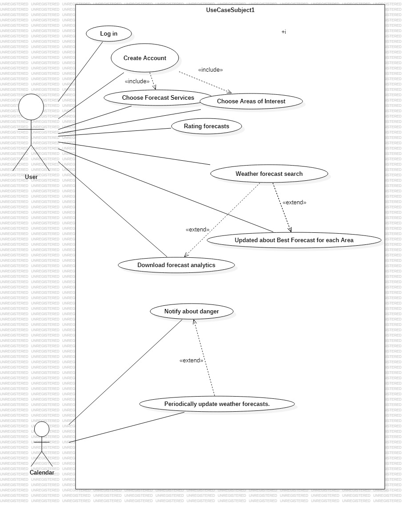
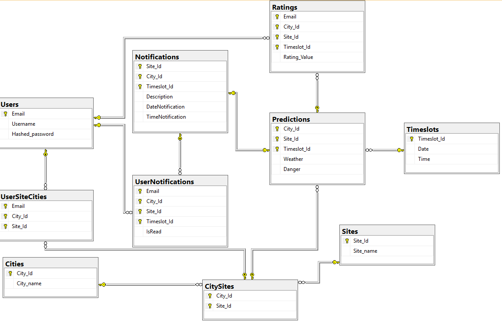

### Disclaimer
The task is not mine. You can view it [here (PDF)](https://github.com/ManosMorf97/Weather-Forecast/blob/main/Weather%20forecasts.pdf)  
The original repository can be found [here](https://github.com/billk97/weather-api).  

However, the approach to the solution is entirely mine.

---

### Use Case Diagram

### ER Diagram (SQL Server Management Studio 21)

---

### Databases
- Microsoft SQL Server

### Backend Implementation
- **Users**: C#, ASP.NET, Entity Framework Core  
- **Calendar**: Node.js, Sequelize  

### Testing
- **Users**: xUnit, AspNetCore.Mvc.Testing, testing database hosted on Docker  
- **Calendar**: Jest  

---

### ToDo
- Implement frontend  
- Rename some variables  
- Optimize database operations for better performance  
